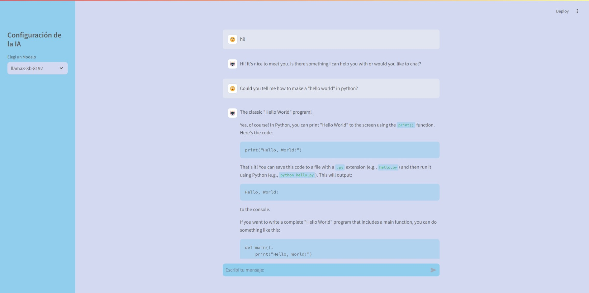

# Chatbot

**Chatbot** is a web application developed with Streamlit and Python, designed to provide interactive conversations with users. This application utilizes advanced natural language processing to offer coherent and context-aware responses, making it a valuable tool for users seeking information or assistance.

 <!-- Replace with the path to your image -->

## Features

- **Interactive Chat Interface**: Engage in real-time conversations with the AI, providing a user-friendly chat interface.
- **Contextual Memory**: Maintains a history of the conversation to ensure coherent interactions, allowing the chatbot to refer back to previous messages.
- **Error Handling**: Robust error management to provide a smooth user experience, even when unexpected issues arise.

